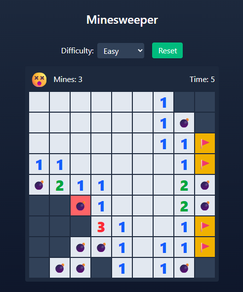

# Setup

1. Run `npm install` in the root folder.
2. Run `npm run dev` in the root folder.
3. Navigate to http://localhost:5173/

# About

This is a mostly vibecoded minesweeper clone using ChatGPT 5.

